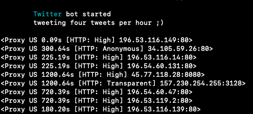

# ProxyTwitter


You can see this bot works on twitter just fine atleast right now. <https://twitter.com/screwlol>

## How it works

* Fetches new proxy addresses many sites and then tweets them to twitter.
* Program is made with python3

## Requirments

```python
import tweepy
import time
import asyncio
from proxybroker import Broker

install them simply pip3 install -r requirments
```

## Tokens

```python
api = ""
api_secret = ""
access_token = ""
access_token_secret = ""
```

Get tokens from <https://developer.twitter.com> and start tweeting.
If you want edit script like what proxies it will find, what countries etc..
<https://proxybroker.readthedocs.io/en/latest/> that will help you.

## Running

Install all requirments and run it with python3.  

```nohup python3 main.py > output.log  &```
   
nohup will run this script at background.  
If you wanna stop the process running do those next commands:

```ps | grep main.py``` #Find PID number  
```kill PID``` #Kill the process with PID number
